适合初学同学练手项目，部署简单，代码简洁清晰；

愿世界和平再无bug

# 一、系统架构

######      前端：vue| elementui

######      后端：springboot | mybatis-plus   

######      环境：jdk1.8+ | mysql | maven

# 二、登录角色

###### 1.管理员

###### 2.用户

# 三、代码及数据库

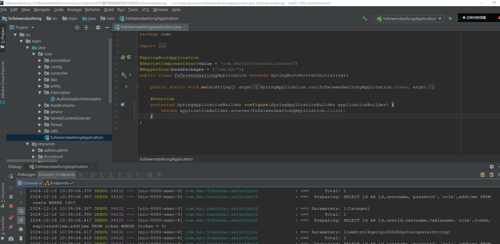

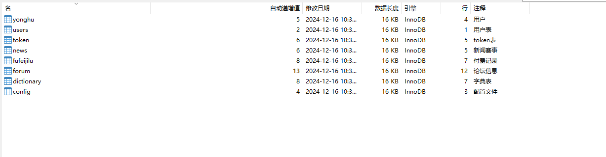

# 四、相关功能介绍

#### 1.管理端

###### (1).登录

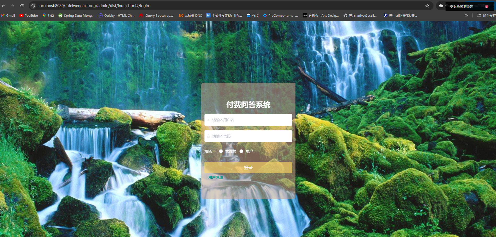

###### (2).修改密码

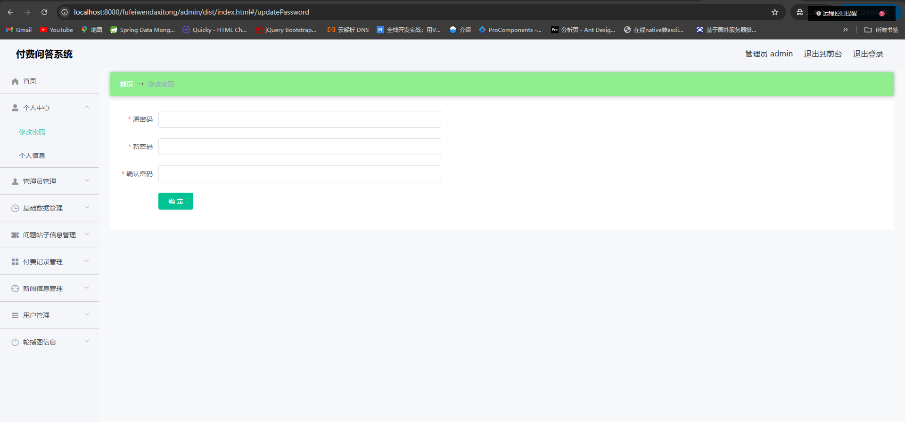

###### (3).管理员信息

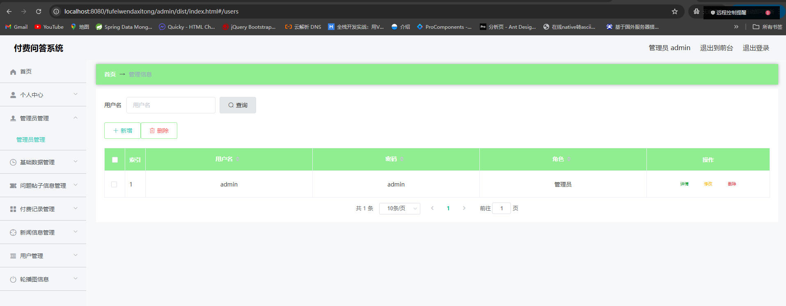

###### (4).基础数据类型

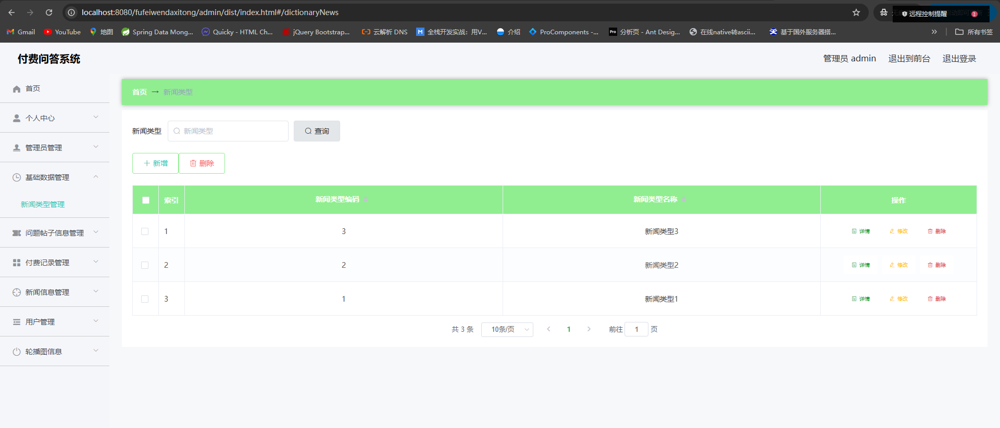

###### (5).问题帖子信息管理

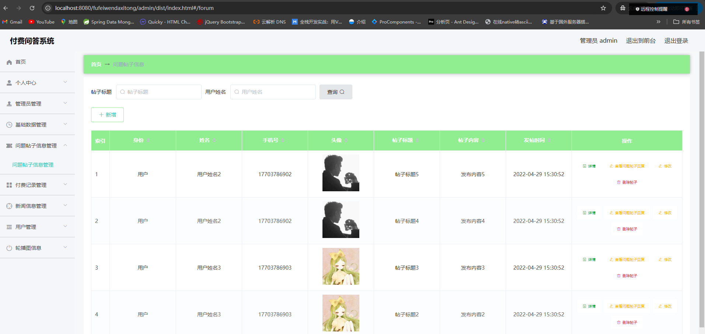

(6).付费记录管理

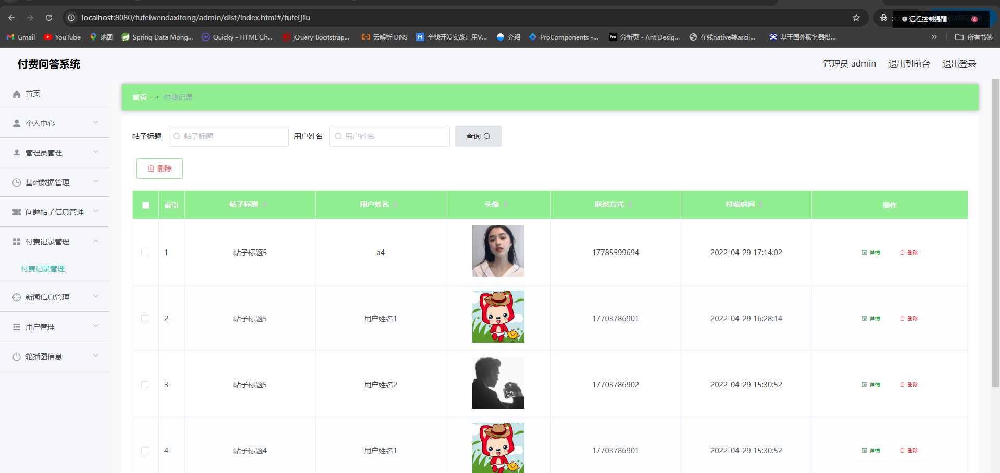

(7).新闻信息管理

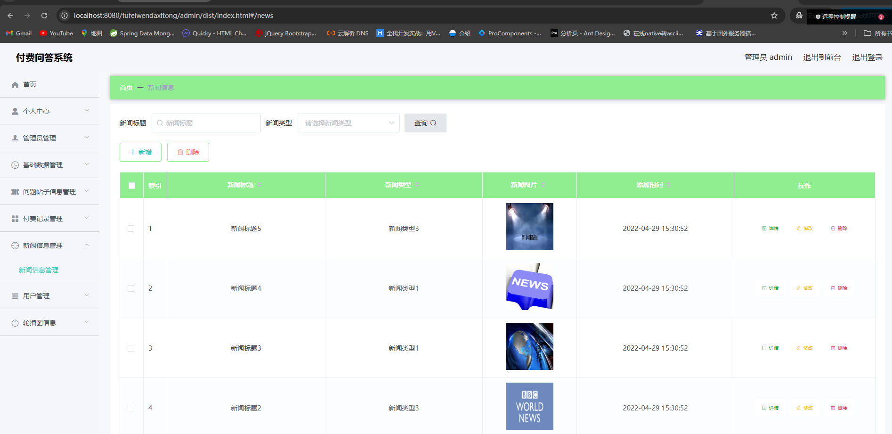

(8).用户管理

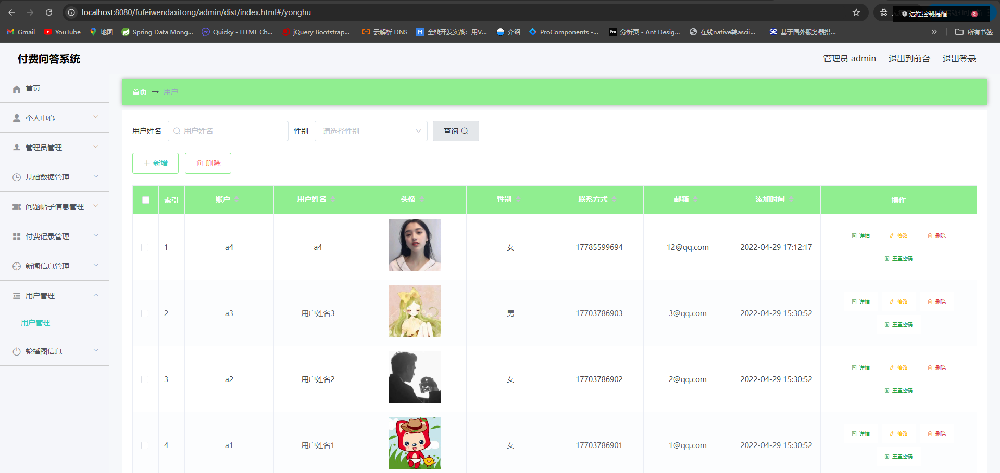

(9).轮播图管理

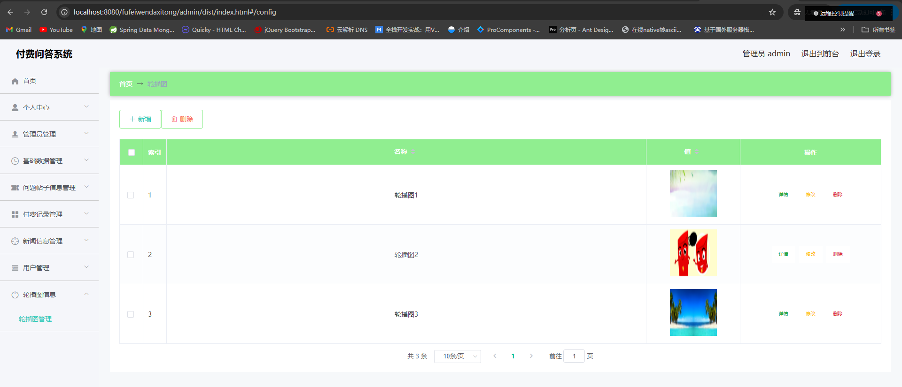

#### 2.用户端

###### (1).修改密码

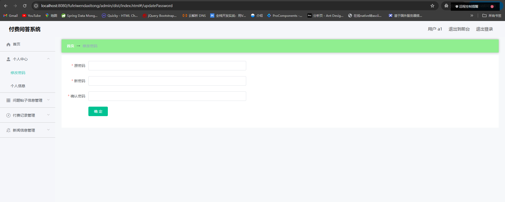

###### (2).个人信息

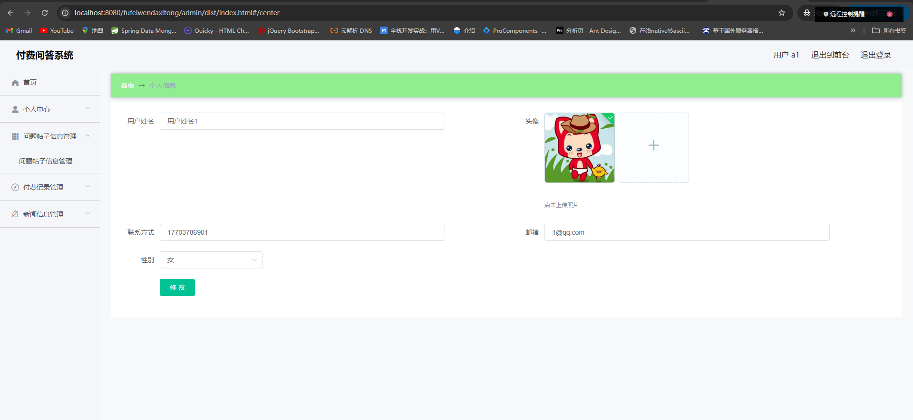

###### (3).付费记录管理

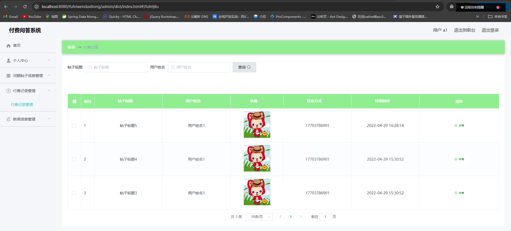

###### (4).新闻信息管理

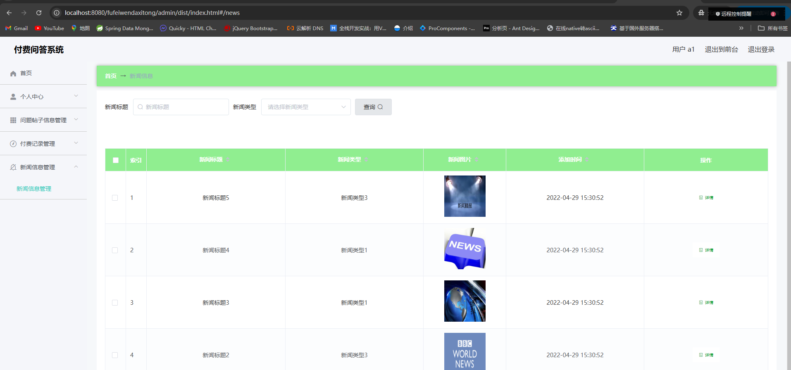

#### 3.用户展示端

###### (1).首页

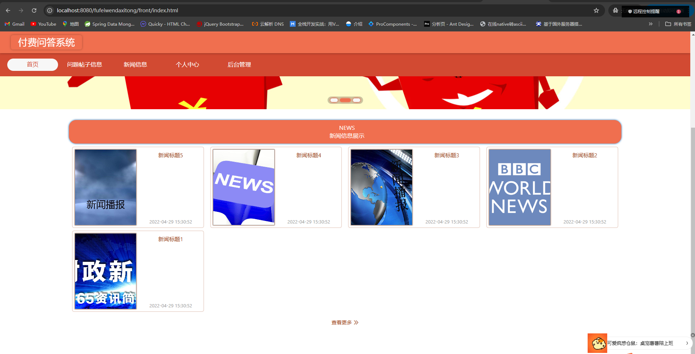

###### (2).问题帖子信息

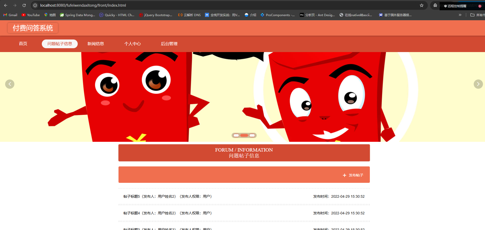

###### (3).发帖

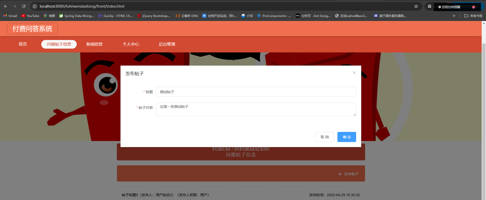

###### (4).帖子详情

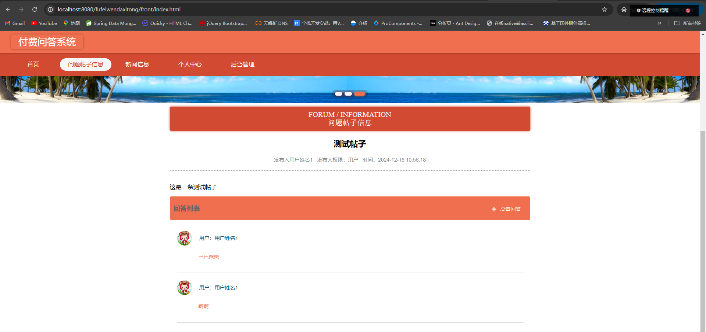

###### (5).回复帖子

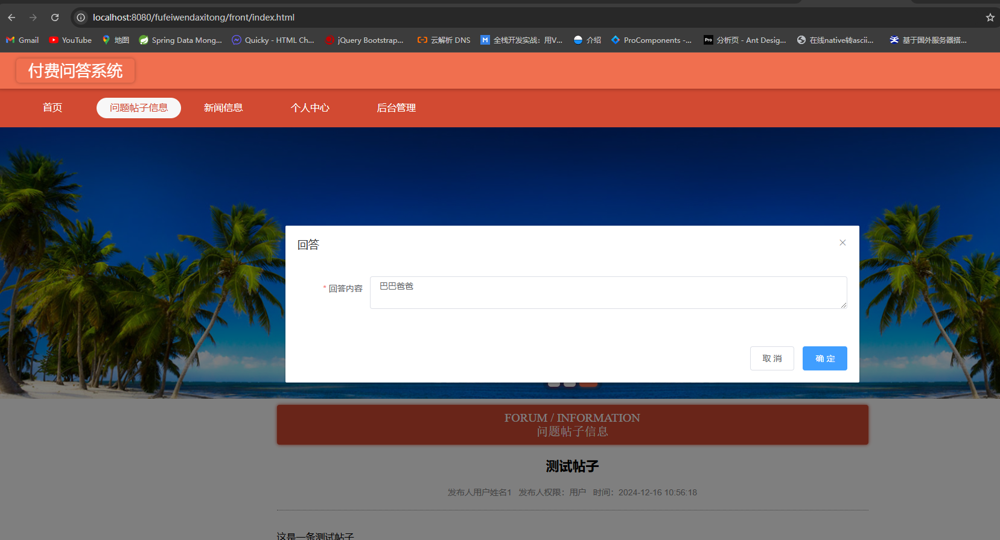

###### (6).个人中心

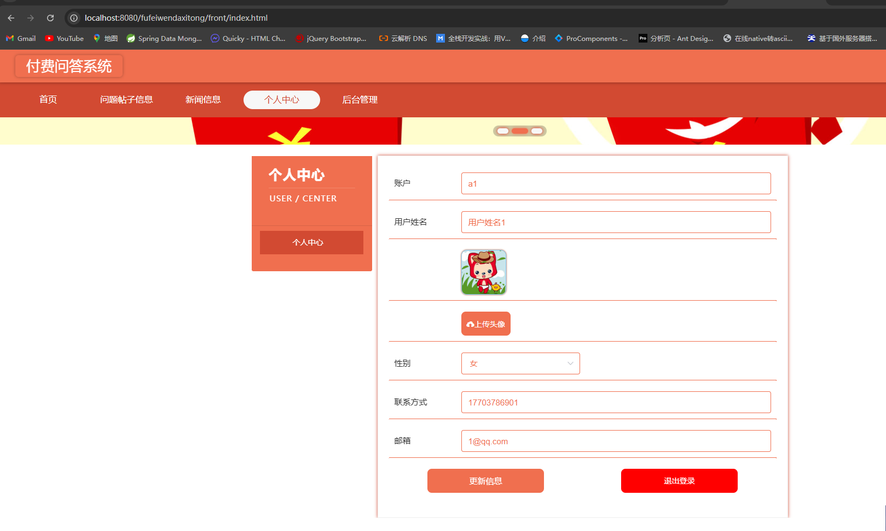

###### (7).新闻信息

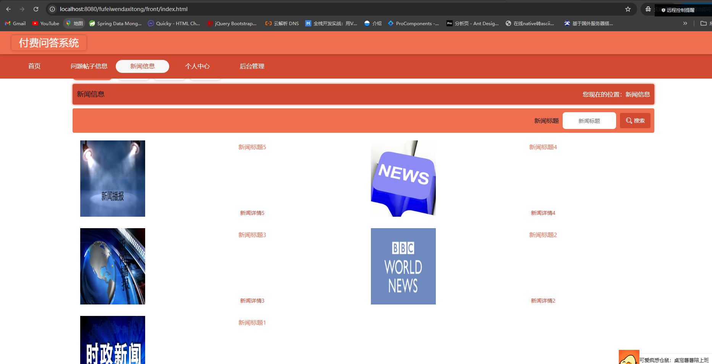

